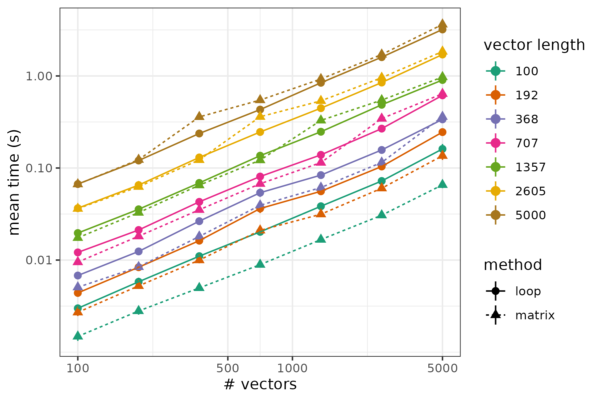

<style>
.refs {
   font-size: 12px;
}
h2 { 
 color: #3399ff;		
}
h3 { 
 color: #3399ff;		
}
.title-slide {
   background-color: #55bbff;
}
</style>
<!-- Limit image width and height -->
<!-- 
img {     
  max-height: 560px;     
  max-width: 800px; 
}
-->
<style type="text/css">
img {     
  max-height: 500px;     
  max-width: 720px; 
}
</style>
<!-- n.b. comment must go outside style tags -->
<!-- https://css-tricks.com/snippets/css/simple-and-nice-blockquote-styling/ -->
<!-- quotes were "\201C""\201D""\2018""\2019"; -->
<style>
blockquote {
  background: #f9f9f9;
  border-left: 10px solid #ccc;
  margin: 1.5em 10px;
  padding: 0.5em 10px;
  quotes: "\201C""\201C""\201C""\201C";
}
blockquote:before {
  color: #ccc;
  content: open-quote;
  font-size: 4em;
  line-height: 0.1em;
  margin-right: 0.25em;
  vertical-align: -0.4em;
}
blockquote p {
  display: inline;
}
</style>

```{r setup, message=FALSE, echo=FALSE}
knitr::opts_chunk$set(echo = TRUE)
library(knitr)
insert_fun <- function(name) {
    read_chunk(lines = capture.output(dump(name, '')),
               labels = paste(name, 'source', sep = '-'))
}
bm <- function(...) {
  bench::mark(...) %>%
    dplyr::select(expression, median, `itr/sec`, mem_alloc) %>%
    mutate(rel_speed = max(`itr/sec`)/`itr/sec`, .after = `itr/sec`) %>%
    mutate(rel_mem = as.numeric(mem_alloc/min(mem_alloc)),
           .after = mem_alloc) %>%
    arrange(rel_speed)
}
library(tidyverse)
```

## plan

This presentation will loosely follow @ross_faster_2013, a [blog post on speeding up R code](http://www.noamross.net/blog/2013/4/25/faster-talk.html)

- why optimize?
- alternative computing platforms
- benchmarking and scaling
- profiling
- low-hanging fruit
    - vectorization
	- not growing objects
	- compiling R code
	- better linear algebra packages

## not (or mostly not) covering

- workflows and version control (see [Software Carpentry](http://software-carpentry.org/))
- Unix shell
(see [Software Carpentry](http://software-carpentry.org/), [SHARCnet](https://www.sharcnet.ca/my/front/) webinars)
- data munging and management (see [Data Carpentry](http://www.datacarpentry.org))

## is it necessary?

> premature optimization is the root of all evil (or at least most of it) in programming ([Donald Knuth](https://en.wikiquote.org/wiki/Donald_Knuth))

> **Uwe's Maxim**: Computers are cheap, and thinking hurts. [@burns_r_2012]

- how long will it take?
- how much do you really need to compute?
    - how many bootstrap runs?
	- how many MCMC samples?
	- how many parameter values?
	
You should be able to justify these decisions in any case!

## running somewhere else {.columns-2}

- laptops are not made for serious computation
- notes on desktop keyboards are annoying

**instead:**

- local servers (?)
- desktop machine, in background
- [SHARCnet](https://www.sharcnet.ca/my/front/)/[Compute Canada](https://docs.alliancecan.ca/wiki/Getting_started)
- cloud services (e.g. Amazon web services)

<p class="forceBreak"></p>


[source](https://web.archive.org/web/20150801003102/https://www.zdnet.com/pictures/weird-tech-12-geeky-uses-for-technology/12/)

## how long will it take? scaling

qualitative analysis: scaling of run time/memory requirements with

- dimension
- number of observations
- number of groups (for multilevel models)
- number of parameters
- ... etc.

Use *small* runs (large enough for stability, e.g. >1 min)
to estimate, scale up

[big-${\cal O}$](https://en.wikipedia.org/wiki/Big_O_notation) estimates (e.g. ${\cal O}(n \log n)$) are useful but only describe *asymptotic* scaling

## how long will it take? benchmarking

- test alternative versions of code to compare performance
- useful for snippets that you're going to put into larger code
- ([thousands of examples on StackOverflow](http://stackoverflow.com/search?q=%5Br%5D+benchmark))
- super-basic: built-in `system.time()`
- R packages: `rbenchmark`, `microbenchmark`, `bench`

## benchmarking example

(note: don't use textbook formulas like $\hat \beta = \left(X^\top X\right)^{-1} X^\top y$ in computation!)

```{r benchmark}
set.seed(101)
n <- 100000; p <- 10
X <- matrix(rnorm(n*p), ncol=p); y <- rnorm(n)
naive <- function() c(solve(t(X)%*%X)%*%t(X)%*%y)
smart <- function() unname(coef(lm.fit(X,y)))
all.equal(naive(), smart())  ## check equivalence
```

## benchmarking results

```{r bm2}
bm(naive(), smart())
```

## profiling

- `Rprof` is the basic machine for profiling
     - `Rprof()` in code outputs profiling information to file
	 - `R CMD Rprof <filename>` analyzes profiling information
- The [Writing R Extensions]() document has a [Tidying and profiling R code](https://cran.r-project.org/doc/manuals/r-release/R-exts.html#Tidying-and-profiling-R-code) section
- the [profvis package](https://rstudio.github.io/profvis/) provides a prettier wrapper
- ... also [aprof package](https://CRAN.R-project.org/package=aprof) ...

## profiling: zero-inflated mixed model example

```{r zipme,eval=FALSE}
source("R/zipme.R")  ## get zipme function
load("data/Owls.rda")   ## get Owls data
library(profvis)
library(lme4)
profvis(z1 <- zipme(cformula=SiblingNegotiation~
                (FoodTreatment+ArrivalTime)*SexParent+
                offset(logBroodSize)+(1|Nest),
            zformula=z ~ 1,
            data=Owls,maxitr=20,tol=1e-6,
            verbose=FALSE))
```

```{r echo=FALSE,eval=FALSE}
aprof("R/aprof_ex.R")
tmp <- tempfile()
## Create a aprof object
fooaprof<-aprof("R/aprof_ex.R",tmp)
```

## profiling: HIV model example

Go to [R/HIV_prof.R](R/HIV_prof.R) ...

# low-hanging fruit

## low-hanging fruit {.columns-2}

- Common performance issues
- Form good R coding habits
- Many ideas from @burns_r_2012
("If you are using R and you think you’re in hell, this is a map for you")

<p class="forceBreak"></p>


## growing objects (Inferno, circle #2)

- building up objects bit by bit is *super*-expensive
- if `i>length(y)`, setting `y[i]` will extend the vector
- growing data frames is even worse
- use `numeric(n)` to pre-allocate vectors
- `data.frame(x=numeric(n),...)`
- or: construct a list of data frames and `do.call(rbind,dfList)` (or `dplyr::bind_rows()`) to put them together

## growing objects: benchmark

```{r vecbench2}
n <- 1e4
y <- 1
growing <- function() { for (i in 1:n) y[i] <- i; y }
vec2 <- function() { y <- numeric(n); y <- 1:n; y }
vec <- function() { y <- 1:n; y }
bm(growing(),vec(), vec2())
```

## vectorization (Inferno, circle #3)

- Sequential operations expensive; every function call counts
- Use *vectorized* operations if possible (e.g. `rowMeans()`, `colMeans()`)
- Also: linear algebra (matrix products, Kronecker products, ...)

```{r vecbench}
y <- numeric(n); x <- 1:n
nonvec <- function() { for (i in 1:n) y[i] <- 2*x[i]; y }
vec <- function() y <- 2*x
bm(nonvec(),vec())
```

## vectorization

Suppose we want to compute the means of `n1` sets of `n2` standard Normal deviates ([R/vecrand.R](R/vecrand.R)): `source("R/vecrand.R")`

```{r loopmat,echo=FALSE}
do_it <- FALSE
source("R/vecrand.R")
```

```{r insertf1,echo=FALSE}
insert_fun("f1")
insert_fun("f2")
insert_fun("f3")
insert_fun("f4")
```
```{r f1-source,eval=FALSE}
##
```

## double loop, no growing

```{r f2-source,eval=FALSE}
##
```

## better versions

```{r f3-source,eval=FALSE}
##
```

```{r f4-source,eval=FALSE}
##
```

## benchmark (100x100)

```{r vecrand}
bm(growing=f1(100,100),
   double_loop=f2(100,100),
   single_loop=f3(100,100),
   matrix=f4(100,100),
   iterations=50,
   check = FALSE)
```

## a small surprise



## another example [@visser_speeding_2015]


## over-vectorizing (Inferno, circle #4)

- sometimes you really can't vectorize
- e.g. iterative computations
- difference between `for` and `*apply` (and `purrr::map`) is semantic
- use what you can understand!

<p></p>

> Everyone knows that debugging is twice as hard as writing a program in the first place. So if you're as clever as you can be when you write it, how will you ever debug it? [Brian Kernighan](https://en.wikiquote.org/wiki/Brian_Kernighan)

## a few more tricks

- compilation
```{r cmp,eval=FALSE}
library(compiler)
cmpfun <- compile(fn)
```
- use simpler data structures (`matrix` faster than `data.frame`)
- use the guts of a function to skip data-checking steps: e.g. `lm` vs `lm.fit` vs `.lm.fit`

## faster machinery

- faster linear algebra libraries [@eddelbuettel_gcbd_2013]
- Rcpp, Julia, ...
- the [fastverse](https://fastverse.github.io/fastverse/)

## use better packages

- Task Views (on [CRAN](https://cran.r-project.org/web/views/))
- `sos::findFn()` (full-text search of CRAN)
- the [tidyverse](https://cran.r-project.org/web/packages/tidyverse/index.html)
     - mostly stylistic
	 - pipe syntax `%>%`, `|>`
	 - faster operations on data
- `data.table`

## asking for help (Inferno #9){.columns-2}

<p>
- include a minimal [reproducible example](http://stackoverflow.com/questions/5963269/how-to-make-a-great-r-reproducible-example) (also see [here](https://carpentries-incubator.github.io/R-help-reprexes/instructor/1-intro-reproducible-examples.html))
- include appropriate context (goal, packages, versions, platform)
- be polite, without groveling
- be specific: say what's not working
- say what you've tried/where you've looked
- don't cross-post
</p>

<p class="forceBreak"></p>

<p>
- `d-r-users@mcmaster.ca`
- [R mailing lists](https://www.r-project.org/mail.html)
- [StackOverflow [r] tag](http://stackoverflow.com/questions/tagged/r?filter=all&sort=active)
</p>

> Getting flamed for asking dumb questions on a public mailing list is all part of growing up and being a man/woman. (Michael Watson, `fortunes` package)

## additional topics

- general-purpose nonlinear minimization
     - derivative vs derivative-free
	 - noisy surfaces
	 - `optim`, `nloptr` package
	 - [optimization task view](https://cran.r-project.org/web/views/Optimization.html); @nash_best_2014
- memoi[sz]ation ([memoise package](https://CRAN.R-project.org/package=memoise))
- code style [DRY; write functions (Inferno circle #5, @wilson_best_2014; "code smells and feels" [@bryanCode2018]]

## a final thought on R

> The moral of the story is that if you want to create a beautiful language, for god’s sake don’t make it useful (@burnsInfernoish2012, "inferno-ish R")

## this talk

```{r qrcode, echo = FALSE, fig.width = 6, fig.height = 6}
library(qrcode)
plot(qr_code("http://github.com/bbolker/compstatsR"))
```

## References {.refs}

