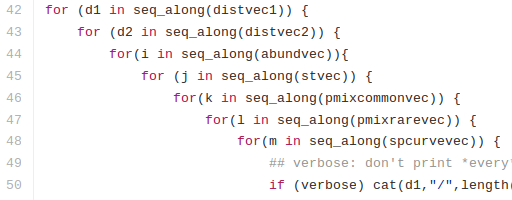

<style>
.refs {
   font-size: 12px;
}
h2 { 
 color: #3399ff;		
}
h3 { 
 color: #3399ff;		
}
.title-slide {
   background-color: #55bbff;
}
</style>
<!-- Limit image width and height -->
<!-- 
img {     
  max-height: 560px;     
  max-width: 800px; 
}
-->
<style type="text/css">
img {     
  max-height: 500px;     
  max-width: 720px; 
}
</style>
<!-- n.b. comment must go outside style tags -->
<!-- https://css-tricks.com/snippets/css/simple-and-nice-blockquote-styling/ -->
<!-- quotes were "\201C""\201D""\2018""\2019"; -->
<style>
blockquote {
  background: #f9f9f9;
  border-left: 10px solid #ccc;
  margin: 1.5em 10px;
  padding: 0.5em 10px;
  quotes: "\201C""\201C""\201C""\201C";
}
blockquote:before {
  color: #ccc;
  content: open-quote;
  font-size: 4em;
  line-height: 0.1em;
  margin-right: 0.25em;
  vertical-align: -0.4em;
}
blockquote p {
  display: inline;
}
</style>
<style>
div#before-column p.forceBreak {
	break-before: column;
}
div#after-column p.forceBreak {
	break-after: column;
}
</style>

```{r setup, message=FALSE, echo=FALSE}
knitr::opts_chunk$set(echo = TRUE)
library(knitr)
insert_fun <- function(name) {
    read_chunk(lines = capture.output(dump(name, '')),
               labels = paste(name, 'source', sep = '-'))
}
```

# Simulation workflows

## Simulations

- frequently part of Master's projects
- more accessible than analytical proofs
- often necessary for evaluating complex methods
   - e.g. *power analyses* of complex experimental setups
- The [FiveThirtyEight election forecasts](http://fivethirtyeight.com/features/a-users-guide-to-fivethirtyeights-2016-general-election-forecast/) are simulation-based

## Simulations: input & output

- many inputs
(e.g. varying parameters, problem dimensions, replicates)
- sometimes many outputs
e.g. a variety of parameter estimates
- then condense parameter estimates to measures of accuracy and precision
(mean squared error, bias, coverage, computation time ...)

## Factorial experiments {.columns-2}

- $p$ parameters, $\{n_1,n_2,\dots,n_p\}$ values for each parameter
- last dimension often = replications
- lots of `for` loops
- *checkpointing*: `save()` or `saveRDS()` frequently (enough) !

<p class="forceBreak"></p>



[source](https://github.com/bbolker/betararef/blob/master/inst/batchfiles/betasim_batch11.R])

## Storing output

- don't grow structures
- fill with `NA` initially
- label everything
- `array()` with *named* `dimnames()`
- can summarize via `apply()` (and `sweep`)
- or converted to long format via `as.data.frame.table` or `reshape2::melt`
- summarize via split-apply-combine (e.g. `dplyr`, `group_by`+`summarise`)

## Storing output (example)

```{r array_dims}
v1_vals <- c(100,200,500)
v2_vals <- 1:10
v3_vals <- c("fast","slow")
res <- array(NA,
  dim=c(length(v1_vals),
        length(v2_vals),
        length(v3_vals)),
  dimnames=list(v1=v1_vals,
                v2=v2_vals,
                v3=v3_vals))
```

## Replication tricks

- for replication can use `replicate(n,<expression>)`
- ... or `plyr::raply(n,<expression>,.progress="text")` (only one p!), 
- **ALWAYS (ALWAYS) SET THE RANDOM NUMBER SEED** with `set.seed()`
- for easier diagnosis, set seed sequentially:  
`for (i in 1:1000) { set.seed(1000+i); ... }`
- use `try()` to catch/skip bad values

```{r try,eval=FALSE}
cur_result <- try(...)
if (is(cur_result,"try-error")) {
    ## maybe nothing
} else {
    ## store results
}
```

## alternatives to factorial designs

- fractional factorial experiments [@box_statistics_1978]
- sensitivity analysis:
pick typical values and vary *one parameter at a time* over sensible ranges
- Latin hypercube
- Sobol sequences

## Latin hypercube

- handy alternative to factorial design
- doesn't scale with problem dimension
- (use quantiles of marginal distribution)
- summarize output: marginal summaries, partial rank correlations
```{r lhs}
dd <- data.frame(v1=1:100,v2=1:100)
dd[] <- lapply(dd,sample)
```

```{r plotlhs,echo=FALSE,fig.height=4,fig.width=4,out.width=300}
par(mar=c(0,0,0,0))
plot(v2~v1,dd,axes=FALSE,ann=FALSE); box()
```

## Sobol sequences

- non-random, "low-discrepancy" sequences
- progressively fills space, evenly
```{r sobol}
library(qrng)
m <- sobol(1000,2)
```
```{r plot_sobol,echo=FALSE,fig.height=4,fig.width=4,out.width=300}
palette(c("black","red","blue")); par(mar=c(0,0,0,0))
cc <- cut(1:1000,breaks=c(0,25,100,1000))
plot(m[,1],m[,2],axes=FALSE,ann=FALSE,
     col=as.numeric(cc)); box()
```

## Organization

- functions in a separate file
- you will always run many versions of your simulation
- `README` file

```
batch 1: ...
batch 2: as above, but with 6 different distances metrics ...
batch 3: as above, but split into 6 separate runs
batch 4: as above, but use new code with equal gamma diversity (= 10 species)
         in each case
```

# Distributed computing

## Distributed computing

- special case of *parallel* computing
- "trivially parallel"
- no communication needed between separate runs
- simplifies hardware, software architecture
- use multiple processors
    - single machine
	- cluster


## parallel package

- distribute computation in various ways - most easily across cores within a single machine, although also on multiple machines via SNOW ("Simple Network of Workstations")
- see `vignette("parallel")`

## parallel basics

- `detectCores()`
- `mclapply` (non-Windows only), `parLapply` (slightly more setup): 2 cores by default
- sometimes-tricky parts: dealing with random numbers (see `parallel` vignette) and (for complex problems) distributing necessary objects to all workers
- very simple for simple problems

```{r parallel,results="hide"}
library(parallel)
mclapply(rep(4,5),rnorm)
```

## caveats

- added complexity
- need sensible decisions about chunking

```{r parbench}
library(rbenchmark)
bcols <- c("test", "replications", "elapsed", "relative","user.self")
benchmark(mclapply(rep(4,1000),rnorm),
          mclapply(rep(1000,4),rnorm),
          lapply(4000,rnorm),
          columns=bcols)
```


## foreach package

- similar to `parallel`
- fancier, larger range of back-ends
- `foreach()` and `%dopar%`
- `.combine`

```{r foreach,eval=FALSE}
foreach(i=1:nrow(m), .combine=rbind) %dopar%
       (m[i,] / mean(m[i,]))
```

## distribution by hand

- no outside machinery
- chunk computations
- multiple `Rscript` or `R CMD BATCH` sessions
- assembly script

## chunking via shell scripts

- write a *shell script* (works on Unix, can be made to work on Windows ...)
- see [example](https://github.com/bbolker/betararef/blob/master/inst/batchfiles/betasim_batch11gen)
```
for ABUND in {1..41}; do
    sed -e "s/ABUND/$ABUND/g" batch_template.R > batch_$ABUND.R
    R CMD BATCH batch_$ABUND.R
done
```

## chunking via command-line arguments

- `commandArgs` retrieves the arguments R was called with

```{r args,eval=FALSE}
argvals <- commandArgs(trailingOnly=TRUE) ## chunk number: full run is (20)x50
## indexed from 0
batch_num <- as.numeric(argvals[1])
batch_size <- as.numeric(argvals[2])
cat(batch_num,batch_size,"\n")
```

```
for ABUND in {1..41}; do
     R CMD BATCH --vanilla "--args $ABUND" batchfile.R
done
```

- could also use R as your engine, e.g. `system()`

## assembly

- read in all files in directory (e.g. `list.files()`)
- `abind` or `do.call(rbind,...)` them together

## SHARCnet basics

- ask your advisor for access, register with Compute Canada
- logging in: `ssh`
- copying files: `scp`, `rsync`
- submitting jobs: `sqsub`
- checking jobs: `sqjobs`
- special stuff for R
    - install packages interactively, from head node
	- need to pick non-HTTPS mirror
	- need `module unload intel; module load r/3.2.3` in scripts

## References {.refs}
